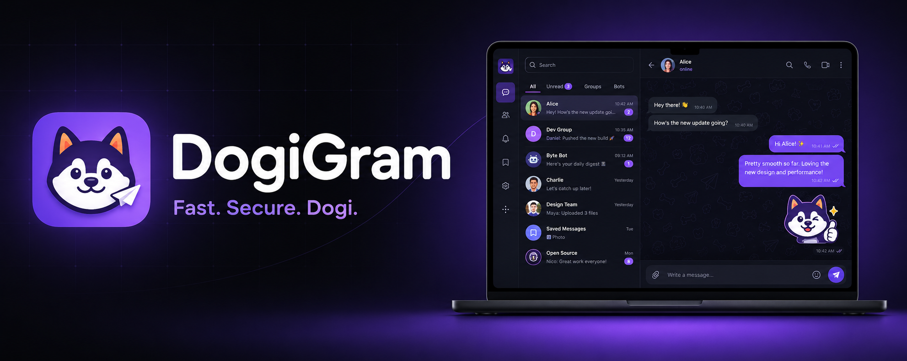

# DogiGram

**Fast. Secure. Dogi.** 🐶

A friendly, open-source Telegram client for Android.

DogiGram is an **unofficial**, open-source Telegram client for Android — built on top of
the official [Telegram for Android](https://github.com/DrKLO/Telegram) source, with its
own dark + violet identity and a friendly Shiba mascot.

> ⚠️ DogiGram is **not affiliated with, endorsed by, or operated by Telegram**. It
> connects to Telegram's servers using the public Telegram API. "Telegram" is a
> trademark of Telegram FZ-LLC.

## ✨ Highlights

- 💬 Full Telegram messaging, built on the latest upstream source
- 🎨 Dark-by-default look with a violet accent
- 🐶 Its own DogiGram identity — installs side by side with official Telegram
- 🔒 The same speed and security you already trust

## 📜 License

DogiGram is licensed under the **GNU General Public License v2 or later** — see
[`LICENSE`](LICENSE).

It is a derivative work of Telegram for Android, Copyright © Nikolai Kudashov and the
Telegram contributors. In accordance with the GPL, the full source of DogiGram is
published in this repository.

## 🙌 Credits

- [@kagut57](https://github.com/kagut57) — creator & maintainer of DogiGram
- [Claude](https://claude.ai/code) (Anthropic) — development assistance
- [Telegram for Android](https://github.com/DrKLO/Telegram) — the upstream project this
  client is based on
- Telegram [API](https://core.telegram.org/api) and
  [MTProto](https://core.telegram.org/mtproto) documentation
