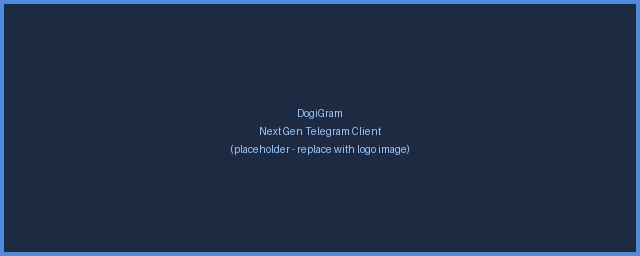

<div align="center">



# DogiGram

**Next Gen Telegram Client for Android**

</div>

DogiGram is an **unofficial**, open-source Telegram client for Android, built on top of
the official [Telegram for Android](https://github.com/DrKLO/Telegram) source code. It
keeps everything that makes Telegram fast and secure, while adding its own identity and
room for extra features.

> ⚠️ DogiGram is **not affiliated with, endorsed by, or operated by Telegram**. It
> connects to Telegram's servers using the public Telegram API. "Telegram" is a
> trademark of Telegram FZ-LLC.

## Features

- Full Telegram messaging built on the latest upstream source (currently v12.8.1)
- Independent app identity — installs side by side with official Telegram
  (`com.dogigram.app`)
- _More DogiGram-specific features coming soon_

## Building DogiGram

You will need **Android Studio**, **Android SDK 35**, and **Android NDK 27.2.x**.

1. Clone this repository.
2. **Get your own API credentials.** Obtain an `api_id` / `api_hash` at
   [my.telegram.org](https://my.telegram.org) and set them in
   `TMessagesProj/src/main/java/org/telegram/messenger/BuildVars.java`
   (`APP_ID` / `APP_HASH`). The bundled placeholders must be replaced before the app
   can connect.
3. Copy your `release.keystore` into `TMessagesProj/config/` and fill out
   `RELEASE_KEY_PASSWORD`, `RELEASE_KEY_ALIAS`, `RELEASE_STORE_PASSWORD` in
   `gradle.properties`.
4. Create Firebase apps for `com.dogigram.app` and `com.dogigram.app.beta`, enable
   Firebase Cloud Messaging, and place the generated `google-services.json` next to the
   app modules. (Push notifications won't work without it.)
5. Build from Android Studio, or from the command line:

   ```bash
   ./gradlew :TMessagesProj_App:assembleAfatRelease
   ```

The app's package id is configured centrally via `APP_PACKAGE` in `gradle.properties`.

## App icon & branding assets

Brand assets live in [`docs/`](docs/):

- `docs/dogigram_icon.png` — master app-icon artwork (the Shiba on the paper plane)
- `docs/dogigram_logo.png` — wordmark logo used in this README

The launcher icons under `TMessagesProj/src/main/res/mipmap-*/` are generated from
`docs/dogigram_icon.png`.

## License

DogiGram is licensed under the **GNU General Public License v2 or later** — see
[`LICENSE`](LICENSE).

It is a derivative work of Telegram for Android, Copyright © Nikolai Kudashov and the
Telegram contributors. In accordance with the GPL, the full source of DogiGram is
published in this repository.

## Credits

- [Telegram for Android](https://github.com/DrKLO/Telegram) — the upstream project this
  client is based on.
- Telegram [API](https://core.telegram.org/api) and
  [MTProto](https://core.telegram.org/mtproto) documentation.
